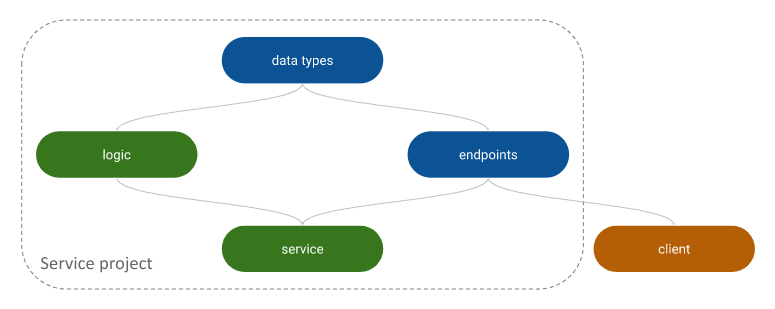
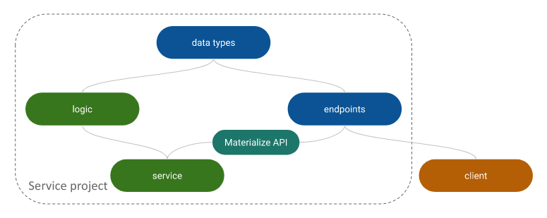

## Service structure
classic diamond structure to allow clients to depend only on contract definition & simple data types,
without exposing any implementation details from `logic`:

### slight variation:

I added a module that does not depend on logic,
and it's sole purpose is to make sure every declared API in the contract is served according to spec,
and vice versa: every served endpoint we want to ensure in the contract is documented.
That module has an extra build scope, which allows to run regular code
(defined under `spec` dir instead of `main`) which is invoked at build time
(with the help of a very simple sbt plugin defined in the `project` dir).

Using the special command `matapi/Spec/specGenMake`,
you can generate the contract spec definition as an OpenAPI yaml file,
default location: `materialize-api/target/openapi.yaml`.

Since it is used only during build,
we use a special build scope instead of `Compile` to avoid contaminating the classpath of the service.

## Experiment
The structure described above is a structure I used a lot.
In the past I always used akka-http and stdlib `Future` as the effect type.

This time, I wanted to try out the ZIO stack.
I added another server module (called `zerver`) which tries to use ZIO instead.

So far ~~no~~ partial luck. \
¯\\\_(ツ)\_/¯
